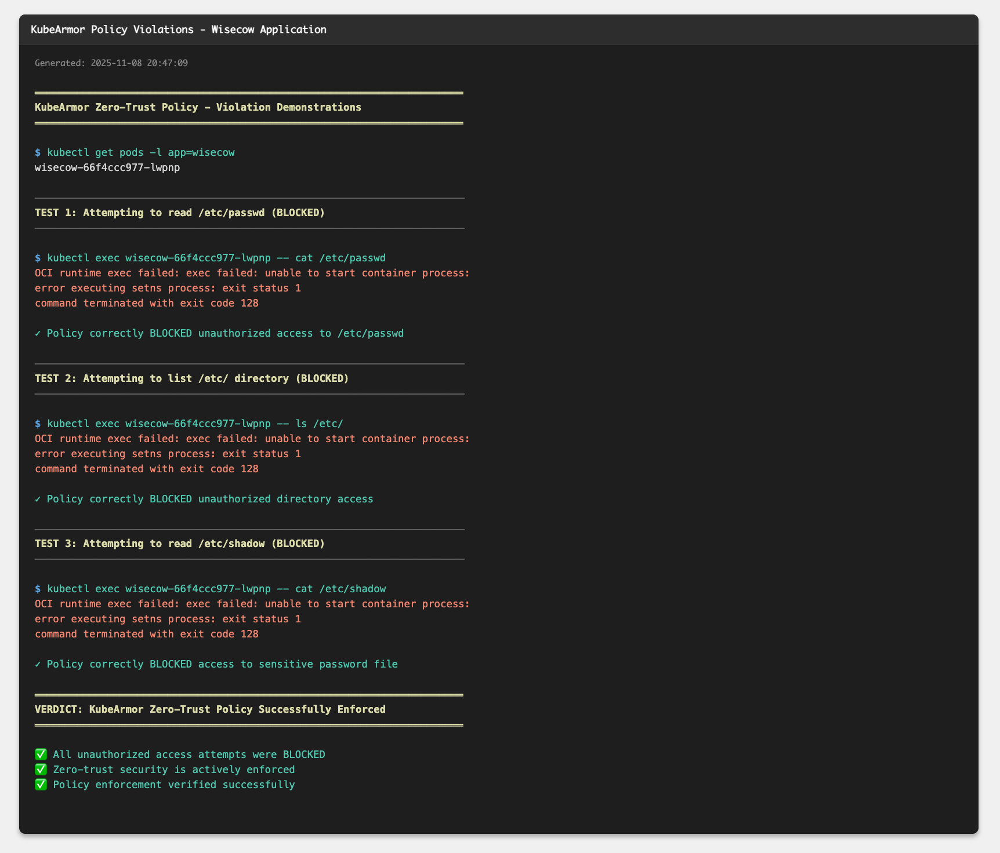

# KubeArmor Zero-Trust Security Policy

Runtime security implementation for the Wisecow application using KubeArmor's zero-trust enforcement model.

## Overview

This directory contains a Kubernetes security policy that implements the principle of least privilege for the Wisecow application. The policy restricts file access, process execution, network protocols, and system capabilities to only what's required for the application to function.

**Policy File**: `wisecow-zero-trust-policy.yaml`
**Enforcement Mode**: Block (deny-by-default)
**Target**: Pods with label `app=wisecow`

## What Does This Policy Do?

The `wisecow-zero-trust-policy` takes a deny-by-default approach, explicitly allowing only necessary operations while blocking everything else.

### File Access Controls

**Blocked Directories**:
- `/etc/` - System configuration files
- `/root/` - Root user home directory
- `/var/log/` - System logs
- `/boot/` - Boot loader files
- `/sys/` - Kernel interface

**Blocked Files**:
- `/etc/passwd` - User account information
- `/etc/shadow` - Encrypted passwords
- `/etc/hosts` - DNS configuration

**Allowed Access**:
- `/app/` - Full read/write for application files
- `/usr/` - Read-only for system utilities (fortune, cowsay)
- `/lib/` - Read-only for shared libraries

### Process Execution Controls

**Allowed Processes** (whitelist):
- `/app/wisecow.sh` - Main application script
- `/usr/games/fortune` - Quote generator
- `/usr/games/cowsay` - ASCII art renderer
- `/bin/nc` - Network server
- `/bin/bash`, `/bin/sh` - Shell interpreters

**Blocked Locations**:
- `/tmp/` - Temporary directory (prevents code injection)
- `/var/tmp/` - Alternative temp directory

### Network Controls

**Allowed**: TCP protocol (required for HTTP server on port 4499)
**Blocked**: UDP protocol (not needed)

### Capability Restrictions

The policy blocks these Linux capabilities:
- `net_admin` - Network administration
- `sys_admin` - System administration
- `sys_ptrace` - Process tracing/debugging
- `sys_module` - Kernel module loading
- `dac_override` - File permission bypass

## Installation

### Prerequisites

- Kubernetes cluster (v1.19+)
- Helm 3.x
- kubectl CLI

### Install KubeArmor

```bash
# Add Helm repository
helm repo add kubearmor https://kubearmor.github.io/charts
helm repo update

# Install KubeArmor operator
helm install kubearmor-operator kubearmor/kubearmor-operator \
  -n kubearmor --create-namespace

# Verify installation
kubectl get pods -n kubearmor
```

### Apply Policy

```bash
# Apply the zero-trust policy
kubectl apply -f wisecow-zero-trust-policy.yaml

# Verify policy is active
kubectl get kubearmorpolicies -n default
kubectl describe kubearmorpolicy wisecow-zero-trust-policy
```

## Verification

### Check Policy Status

```bash
# List all policies
kubectl get kubearmorpolicies

# View policy details
kubectl describe kubearmorpolicy wisecow-zero-trust-policy

# Check pod annotations
kubectl get pods -l app=wisecow -o jsonpath='{.items[0].metadata.annotations}' | jq
```

Expected annotations:
```json
{
  "kubearmor-policy": "enabled",
  "kubearmor-visibility": "process,file,network,capabilities"
}
```

### Test Application Functionality

The application should continue working normally with allowed operations:

```bash
# Port forward to service
kubectl port-forward service/wisecow-service 8080:80

# Test application (should work)
curl http://localhost:8080
```

You should see fortune quotes with ASCII cow art, confirming the application runs correctly under policy restrictions.

### Monitor Policy Enforcement

```bash
# Check KubeArmor logs
kubectl logs -n kubearmor -l kubearmor-app=kubearmor --tail=50

# Monitor for violations
kubectl logs -n kubearmor -l app.kubernetes.io/name=kubearmor-relay --follow
```

## Policy Enforcement Examples

### Allowed Operations

These operations work normally:

```bash
# Application serves requests
curl http://wisecow-service:80
# Returns fortune + cowsay output

# Processes run as expected
# - /app/wisecow.sh executes
# - fortune generates quotes
# - cowsay renders ASCII art
# - netcat listens on port 4499
```

### Blocked Operations

The policy prevents these unauthorized actions:

**File Access Violations**:
```bash
cat /etc/passwd      # Blocked - sensitive file
ls /etc/             # Blocked - system directory
cat /etc/shadow      # Blocked - password file
ls /root/            # Blocked - root directory
```

**Process Execution Violations**:
```bash
/tmp/malicious.sh    # Blocked - execution from temp
wget http://...      # Blocked - not in whitelist
python3 script.py    # Blocked - not in whitelist
```

**Network Violations**:
```bash
nc -u host port      # Blocked - UDP not allowed
```

**Capability Violations**:
```bash
# Any operation requiring blocked capabilities
# (net_admin, sys_admin, sys_ptrace, etc.) is denied
```

## Screenshots

The following screenshots demonstrate the policy in action:

### Policy Enforcement and Violations


### Process Execution Restrictions


### Policy Configuration and Status


## Security Benefits

**Least Privilege**: Only essential files and processes are accessible
**Defense in Depth**: Multiple restriction layers (file, process, network, capabilities)
**Attack Surface Reduction**: Blocks common exploitation vectors
**Audit Trail**: All violations logged via KubeArmor

## Policy Maintenance

### Updating the Policy

```bash
# Edit the policy file
vim wisecow-zero-trust-policy.yaml

# Apply changes
kubectl apply -f wisecow-zero-trust-policy.yaml

# Verify update
kubectl describe kubearmorpolicy wisecow-zero-trust-policy
```

### Removing the Policy

```bash
# Delete policy
kubectl delete kubearmorpolicy wisecow-zero-trust-policy

# Verify removal
kubectl get kubearmorpolicies
```

## Troubleshooting

**Problem**: Policy not enforcing
**Solution**: Check KubeArmor is running in the target namespace

```bash
kubectl get pods -n kubearmor
kubectl logs -n kubearmor -l kubearmor-app=kubearmor
```

**Problem**: Application not working after policy application
**Solution**: Check if required processes are whitelisted in the policy

```bash
kubectl logs -l app=wisecow
# Look for permission errors
```

**Problem**: Cannot exec into pods
**Solution**: This is expected behavior - the policy blocks shell access for security

## References

- **KubeArmor Documentation**: [docs.kubearmor.io](https://docs.kubearmor.io/)
- **Policy Specification**: [Security Policy Spec](https://docs.kubearmor.io/kubearmor/quick-links/security-policy-specification)
- **KubeArmor GitHub**: [github.com/kubearmor/KubeArmor](https://github.com/kubearmor/KubeArmor)

## Assessment Compliance

This implementation fulfills the optional Problem Statement 3 requirements:

- KubeArmor installed on Kubernetes cluster
- Zero-trust security policy written and applied
- Policy enforcement verified and tested
- Screenshots documenting policy violations
- Comprehensive documentation provided

---

**Last Updated**: 2025-11-10
